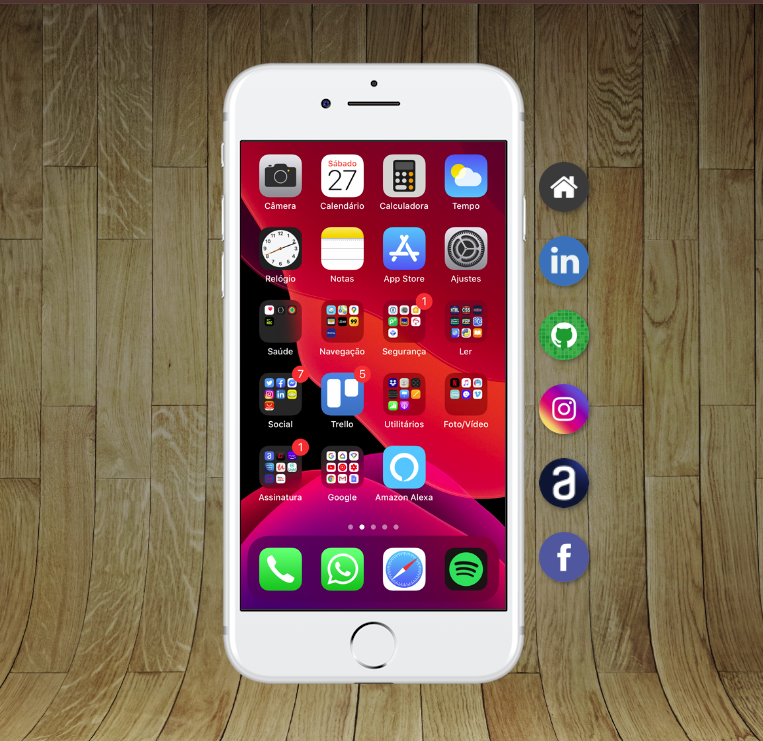
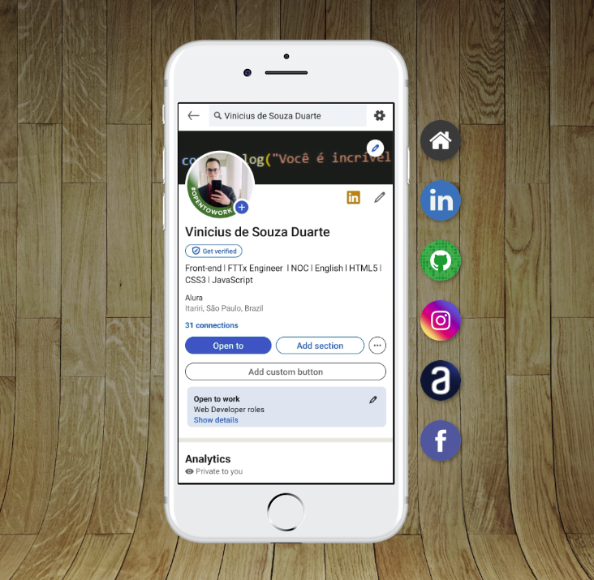

# Curso em Video - Project Social

Project made in the final steps of [chapter 23 from HTML and CSS](https://www.cursoemvideo.com/curso/curso-html5-e-css3-modulo-4-de-5-40-horas/) course.

## Table of contents

- [Overview](#overview)
  - [The challenge](#the-challenge)
  - [Screenshot](#screenshot)
  - [Links](#links)
- [My process](#my-process)
  - [Built with](#built-with)
  - [What I learned](#what-i-learned)
  - [Continued development](#continued-development)
  - [Useful resources](#useful-resources)
- [Author](#author)

## Overview

Simulating a cellphone!

### The challenge

Users should be able to:

- Create a responsive website, wich the cellphone will always be on the center.
- Create aside buttons that links my social medias.
- The selected buttom will change the cellphone content.
- A link at the end of the page, that goes to the selected website.

### Screenshot

### Links

- Solution URL: [GitHub](https://github.com/ViniCellist/CursoEmVideo-Social)

## My process

- Mobile First

### Built with

- Semantic HTML5 markup
- CSS custom properties
- Flexbox
- Mobile-first workflow

### What I learned

Practicing skills...

### Continued development

Working to become a fullstack

### Useful resources

- [HTML5](https://developer.mozilla.org/en-US/docs/Web) - Documentation.
- [CSS3](https://developer.mozilla.org/pt-BR/docs/Web/CSS) - Documentation.
- [Flexbox](https://developer.mozilla.org/pt-BR/docs/Learn/CSS/CSS_layout/Flexbox) - Documentation.

## Author

- GitHub - [Portfolio](https://github.com/ViniCellist)
- Frontend Mentor - [Profile](https://www.frontendmentor.io/profile/ViniCellist)
- Instagram - [Personal](https://www.instagram.com/vinicius_duartesd/)
- LinkedIn - [Professional](https://www.linkedin.com/in/viniciussouzaduarte/)